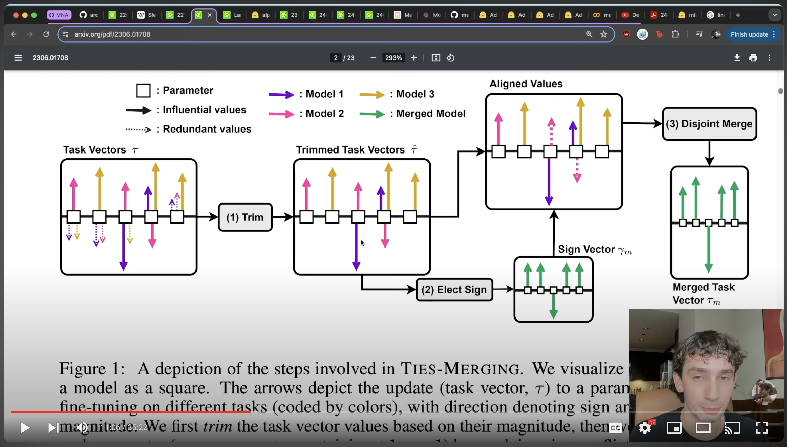

# Code from my Model Merging Video!

Click play to watch :) 

Models created via various model merging techniques using [mergekit](https://github.com/arcee-ai/mergekit/tree/main).  
1. [AdamLucek/gemma2-2b-it-chinese-german](https://huggingface.co/AdamLucek/gemma2-2b-it-chinese-german) w/
2. [AdamLucek/EduMixtral-4x7B](https://huggingface.co/AdamLucek/EduMixtral-4x7B)
3. [AdamLucek/llama3-8b-code-sql-slerp](https://huggingface.co/AdamLucek/llama3-8b-code-sql-slerp)
4. [AdamLucek/Phi-3-mini-EmoMarketing-DELLA](https://huggingface.co/AdamLucek/Phi-3-mini-EmoMarketing-DELLA)

Mergekit config files in [merging_configs](/merging_configs)!